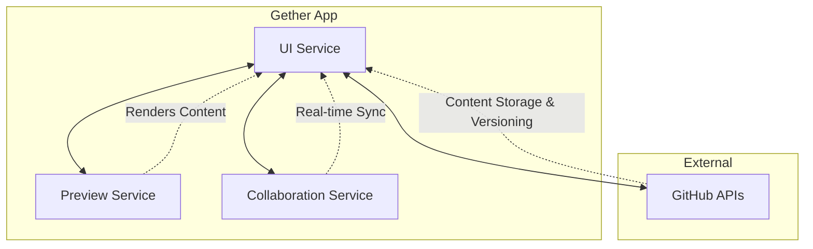

```mermaid
flowchart TB

subgraph "Gether App"

UI[UI Service]

Preview[Preview Service]

Collab[Collaboration Service]

end


subgraph "External"

GitHub[GitHub APIs]

end


UI <--> Preview

UI <--> Collab

UI <--> GitHub


Preview -.->|Renders Content| UI

Collab -.->|Real-time Sync| UI

GitHub -.->|Content Storage & Versioning| UI
```
